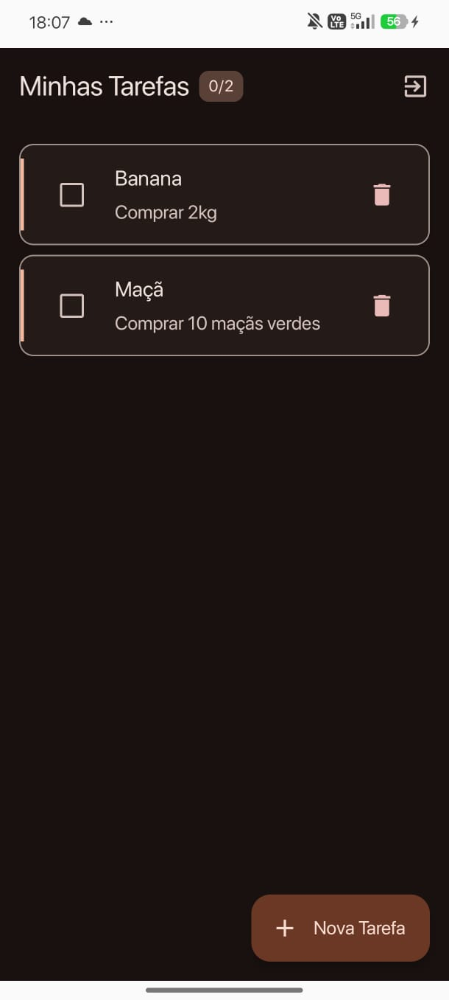
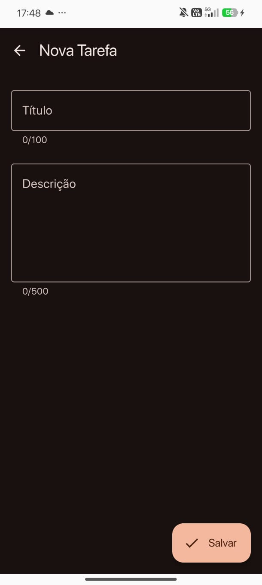

# TodoList com Autenticação Firebase

Trabalho 3 - Desenvolvimento Mobile  

## Visão Geral

Este projeto é uma evolução do aplicativo TodoList desenvolvido no Trabalho 1, agora integrado com autenticação de usuários via Firebase Authentication. O objetivo é introduzir conceitos de integração com cloud, back-end, autenticação e gerenciamento avançado de estado, mantendo as melhores práticas de arquitetura Android com Jetpack Compose e MVVM.

## Funcionalidades

### Autenticação
- Login com email e senha
- Cadastro de novos usuários
- Logout
- Validação de campos e tratamento de erros
- Verificação automática de sessão ao abrir o app

### Gerenciamento de Tarefas
- Visualização de todas as tarefas do usuário logado
- Adicionar novas tarefas com título e descrição
- Editar tarefas existentes
- Excluir tarefas
- Marcar tarefas como concluídas
- Cada usuário vê apenas suas próprias tarefas

## Telas do Aplicativo

### 1. Tela de Login


Tela inicial do aplicativo. O usuário insere email e senha para acessar suas tarefas. Possui link para a tela de cadastro.

### 2. Tela de Cadastro


Permite criar uma nova conta. O usuário fornece email e senha, com validações e feedback de erros do Firebase.

### 3. Tela de Lista de Tarefas


Exibe as tarefas do usuário autenticado. É possível marcar como concluída, excluir e editar. Possui botão de logout.

### 4. Tela de Adicionar/Editar Tarefa


Formulário para criar ou editar tarefas. Contém campos para título e descrição opcional.

## Arquitetura

O projeto segue o padrão MVVM (Model-View-ViewModel) com Clean Architecture e usa Dependency Injection através do Hilt.

```
UI Layer (Presentation)
├── Screens (Compose)
├── ViewModels
└── Navigation

Domain Layer
└── Models (Todo, AuthState)

Data Layer
├── Repository
├── Room Database
└── Firebase Authentication
```

### Camadas

**UI Layer**
- Screens: Composables que definem a interface
- ViewModels: Gerenciam estado e lógica de apresentação
- Navigation: Sistema de navegação type-safe

**Domain Layer**
- Models: Classes de domínio (Todo, AuthState)

**Data Layer**
- Repository: Abstração para acesso aos dados
- Room: Banco de dados local
- Firebase: Autenticação remota

## Tecnologias Utilizadas

- Kotlin
- Jetpack Compose (UI declarativa)
- Compose Navigation (navegação type-safe)
- Hilt/Dagger (injeção de dependências)
- ViewModel (gerenciamento de estado)
- Coroutines & Flow (programação assíncrona)
- Room Database (persistência local)
- Firebase Authentication (autenticação)
- KSP (processamento de anotações)

## Modelo de Dados

### TodoEntity

Entidade principal do banco de dados Room:

```kotlin
@Entity(tableName = "todos")
data class TodoEntity(
    @PrimaryKey(autoGenerate = true) 
    val id: Long = 0,
    val title: String,
    val description: String?,
    val isCompleted: Boolean,
    val userId: String = ""
)
```

Campos:
- id: identificador único
- title: título da tarefa
- description: descrição (opcional)
- isCompleted: se a tarefa está concluída
- userId: ID do usuário (para isolar dados)

### Todo (Domain Model)

Modelo usado na camada de apresentação:

```kotlin
data class Todo(
    val id: Long,
    val title: String,
    val description: String?,
    val isCompleted: Boolean
)
```

### AuthState

Estados possíveis da autenticação:

```kotlin
sealed class AuthState {
    object Authenticated : AuthState()
    object Unauthenticated : AuthState()
    object Loading : AuthState()
    data class Error(val message: String) : AuthState()
}
```

## Implementação da Persistência

### 1. Banco de Dados Local (Room)

O app usa Room Database versão 2. Foi necessário fazer uma migração da versão 1 para 2 para adicionar o campo `userId`.

TodoDatabase:
```kotlin
@Database(entities = [TodoEntity::class], version = 2)
abstract class TodoDatabase : RoomDatabase() {
    abstract val todoDao: TodoDao
}
```

Migração 1 para 2:
```kotlin
val MIGRATION_1_2 = object : Migration(1, 2) {
    override fun migrate(database: SupportSQLiteDatabase) {
        database.execSQL(
            "ALTER TABLE todos ADD COLUMN userId TEXT NOT NULL DEFAULT ''"
        )
    }
}
```

TodoDao (interface de acesso aos dados):
```kotlin
@Dao
interface TodoDao {
    @Insert(onConflict = OnConflictStrategy.REPLACE)
    suspend fun insert(entity: TodoEntity)
    
    @Delete
    suspend fun delete(entity: TodoEntity)
    
    @Query("SELECT * FROM todos WHERE userId = :userId")
    fun getAll(userId: String): Flow<List<TodoEntity>>
    
    @Query("SELECT * FROM todos WHERE id = :id")
    suspend fun getBy(id: Long): TodoEntity?
}
```

A query `getAll` filtra por userId para garantir que cada usuário veja apenas suas tarefas. Usamos Flow para observar mudanças no banco de forma reativa.

### 2. Firebase Authentication

Gerenciado pelo AuthViewModel:

```kotlin
class AuthViewModel @Inject constructor() : ViewModel() {
    private val auth = FirebaseAuth.getInstance()
    
    fun login(email: String, password: String) {
        auth.signInWithEmailAndPassword(email, password)
            .addOnSuccessListener { 
                _authState.value = AuthState.Authenticated 
            }
            .addOnFailureListener { 
                _authState.value = AuthState.Error(it.message ?: "Erro") 
            }
    }
    
    fun signup(email: String, password: String) {
        auth.createUserWithEmailAndPassword(email, password)
            .addOnSuccessListener { 
                _authState.value = AuthState.Authenticated 
            }
            .addOnFailureListener { 
                _authState.value = AuthState.Error(it.message ?: "Erro") 
            }
    }
    
    fun getCurrentUserId(): String? = auth.currentUser?.uid
}
```

O Firebase cuida da criação de contas, login, logout e verificação de sessão.

### 3. Repository Pattern

O TodoRepositoryImpl conecta o Room com a lógica de negócio e injeta automaticamente o userId:

```kotlin
class TodoRepositoryImpl(
    private val dao: TodoDao,
    private val authViewModel: AuthViewModel
) : TodoRepository {
    
    override fun getAll(): Flow<List<Todo>> {
        val userId = authViewModel.getCurrentUserId() ?: ""
        return dao.getAll(userId).map { entities ->
            entities.map { it.toDomain() }
        }
    }
    
    override suspend fun insert(todo: Todo) {
        val userId = authViewModel.getCurrentUserId() ?: ""
        dao.insert(todo.toEntity(userId))
    }
}
```

O Repository faz a conversão entre TodoEntity (banco) e Todo (domínio), além de garantir que todas as operações usem o userId correto.

## Configuração e Instalação

### Requisitos
- Android Studio
- JDK 17 ou superior
- SDK Android API 24+
- Conta no Firebase

### Como executar

1. Clone o repositório
```bash
git clone https://github.com/seu-usuario/todolist-auth.git
cd todolist-auth
```

2. Configure o Firebase
- Acesse o Firebase Console
- Crie um projeto
- Adicione um app Android
- Baixe o arquivo `google-services.json`
- Coloque em `app/google-services.json`

3. Build e execução
```bash
./gradlew build
./gradlew installDebug
```

Ou execute direto pelo Android Studio.

## Estrutura do Projeto

```
com.example.todolist/
│
├── auth/
│   ├── AuthViewModel.kt
│   ├── LoginScreen.kt
│   └── SignupScreen.kt
│
├── data/
│   ├── TodoDao.kt
│   ├── TodoDatabase.kt
│   ├── TodoEntity.kt
│   ├── TodoRepository.kt
│   └── TodoRepositoryImpl.kt
│
├── di/
│   └── AppModule.kt
│
├── domain/
│   └── Todo.kt
│
├── navigation/
│   └── TodoNavHost.kt
│
├── ui/
│   ├── components/
│   │   └── TodoItem.kt
│   ├── feature/
│   │   ├── addEdit/
│   │   │   ├── AddEditEvent.kt
│   │   │   ├── AddEditScreen.kt
│   │   │   └── AddEditViewModel.kt
│   │   └── list/
│   │       ├── ListEvent.kt
│   │       ├── ListScreen.kt
│   │       └── ListViewModel.kt
│   ├── theme/
│   │   ├── Color.kt
│   │   ├── Theme.kt
│   │   └── Type.kt
│   └── UiEvent.kt
│
├── MainActivity.kt
└── TodoApp.kt
```

## Decisões de Arquitetura

### MVVM com Clean Architecture
Escolhemos MVVM porque separa bem as responsabilidades e facilita testes. A View só renderiza, o ViewModel gerencia estado e lógica, e o Repository abstrai onde os dados vêm.

### Single Activity
Usamos uma única Activity com Compose Navigation porque melhora a performance e simplifica a navegação.

### Hilt para Injeção de Dependências
Hilt reduz boilerplate e gerencia automaticamente o ciclo de vida das dependências.

### Flow para Observação Reativa
Flow é moderno, assíncrono e se integra bem com Compose através do `collectAsState()`.

### Type-Safe Navigation
Usamos navegação type-safe com Kotlinx Serialization para evitar erros de argumentos em tempo de compilação.

### Firebase Authentication
Firebase é uma solução robusta, gratuita e escalável. Facilita adicionar outros métodos de login no futuro.

### Room Database com Migrations
Room oferece persistência offline, queries type-safe e se integra bem com Coroutines. A migração garante que usuários que já tinham o app antigo não percam dados.

### Isolamento de Dados por Usuário
Adicionamos o campo `userId` nas tarefas para garantir privacidade. Cada usuário só vê suas próprias tarefas.

## Melhorias Futuras

### Funcionalidades
- Sincronizar tarefas com Firestore (backup na nuvem)
- Recuperação de senha via email
- Login com Google
- Categorias e tags para organizar tarefas
- Sistema de prioridades (Alta/Média/Baixa)
- Notificações para lembrar tarefas
- Deadline/prazo para tarefas
- Busca e filtros
- Modo escuro
- Compartilhar listas com outros usuários

### Técnicas
- Testes unitários (ViewModels, Repository)
- Testes de UI com Compose Testing
- CI/CD com GitHub Actions
- Firebase Analytics
- Crashlytics para erros
- Paginação para listas grandes
- Suporte a múltiplos idiomas

### Segurança
- Verificação de email
- Requisitos de senha forte
- Login com biometria (digital/face)
- Criptografia de dados sensíveis

## Autores

- Marcel Chiarelo
- Gisele Iasbeck

## Licença

Projeto desenvolvido para fins acadêmicos - Disciplina de Programação Para Dispositivos Móveis.

